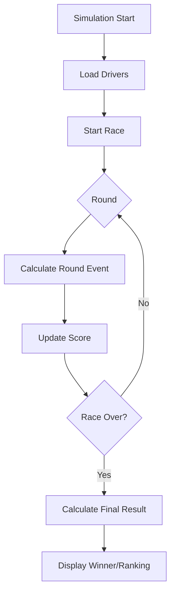

<div align="center">

# 🏁 Mario Kart Simulator with JavaScript

[🇧🇷 Português](./README.md) • [🇺🇸 English](./README.en.md)

**Terminal racing simulator with Mario Kart characters using Node.js and JavaScript**

[](https://nodejs.org/)
[](https://developer.mozilla.org/en-US/docs/Web/JavaScript)
[](LICENSE)
[](#)

[Features](#-features) • [Technologies](#-technologies) • [Installation](#-installation) • [How to Play](#-how-to-play) • [Architecture](#-architecture)

</div>

---

## 📖 Description

This project is a **Mario Kart terminal racing simulator built with Node.js and JavaScript**, developed as a hands-on exercise in DIO's Node.js course.

The application runs races with characters, laps, and simple scoring rules, focusing on core programming concepts such as:

- ✅ **JavaScript module-based structure**
- ✅ **Rule-driven game logic**
- ✅ **Asynchronous programming**
- ✅ **Data manipulation with objects and arrays**
- ✅ **Code organization and readability**

The entire simulation runs in the terminal, allowing you to follow each race step and the final outcome.

---

## 🚀 Features

| Feature | Description |
|---------|-------------|
| 🏎 **Race Simulation** | Runs a full terminal race with round-by-round events |
| 🎮 **Mario Kart Characters** | Race between drivers with different attributes |
| 🧠 **Game Rules** | Applies performance and scoring logic during the race |
| 🎲 **Random Events** | Introduces result variations in each run |
| 📊 **Final Result** | Displays the final ranking/winner at the end |

---

## 🛠 Technologies

### Backend / Runtime
- **[Node.js](https://nodejs.org/)** - JavaScript runtime environment
- **[JavaScript](https://developer.mozilla.org/en-US/docs/Web/JavaScript)** - Main project language

### Development Tools
- **[Git](https://git-scm.com/)** - Version control
- **[GitHub](https://github.com/)** - Hosting and collaboration
- **[VS Code](https://code.visualstudio.com/)** - Recommended editor

---

## 📂 Project Structure

```bash
.
├── src/                      # Main source code
│   ├── services/             # Core game engine logic and business rules
│   ├── utils/                # Utility functions
│   └── index.js              # Simulation entry point
├── package.json              # Dependencies and npm scripts
└── README.md                 # Project documentation
```

> The structure above may vary slightly as the project evolves.

### How Everything Connects

**Simulation Flow:**

```text
Project execution
    ↓
Character loading
    ↓
Race start (rounds/laps)
    ↓
Game rules application
    ↓
Score/performance update
    ↓
Final result in terminal
```

1. The main file starts the simulation.
2. Characters are loaded with their attributes.
3. The race is processed step by step.
4. The score is calculated according to events.
5. The winner (or ranking) is displayed at the end.

---

## ⚙️ Installation

### Prerequisites
- **Node.js** (v18 or higher)
- **npm**

### Steps

1. **Clone the repository**
```bash
git clone https://github.com/MayconDMS/Mario-Kart-Simulator-with-javascript.git
cd Mario-Kart-Simulator-with-javascript
```

2. **Install dependencies**
```bash
npm install
```

---

## ▶ How to Play

Run the simulator with:

```bash
npm start
```

> If the project uses a different run script (for example `node src/index.js`), adjust according to `package.json`.

The output will be shown directly in the terminal with race progress and final results.

---

## 🧪 Tests

This project is focused on practical simulation and validation through terminal execution.

Manual validation suggestions:

- Run multiple races to observe variations
- Check whether scoring rules are consistent
- Validate behavior in tie scenarios

---

## 🏗 Architecture



---

## 📚 Learning Objectives

This project reinforces the following concepts:

### 1. **Programming Logic with JavaScript**
   - Conditionals and loops
   - Business rule organization
   - Problem-solving with simple algorithms

### 2. **Modularization**
   - Separation by files and responsibilities
   - Function reusability
   - Cleaner and more scalable code

### 3. **Asynchronous Programming**
   - Controlled execution flow
   - Asynchronous operations in Node.js
   - Better readability of simulation steps

### 4. **Data Modeling**
   - Using objects to represent drivers
   - Manipulating arrays for ranking
   - Updating states during the race

### 5. **Project Best Practices**
   - Clear naming conventions
   - Separation of concerns
   - Readability and maintainability

---

## 🔮 Future Improvements

- 🧩 Add new characters and special abilities
- 🌧 Add track types and weather conditions
- 🧠 Improve driver AI/behavior
- 📊 Display detailed per-race statistics
- 🎯 Create a championship mode with multiple stages
- 🧪 Add automated tests
- 🖥 Build a web interface to visualize races

---

## 👨‍💻 Author

**Maycon DMS**

- 🔗 [GitHub](https://github.com/MayconDMS)
- 💼 [LinkedIn](https://linkedin.com/in/maycon-dms)

---

## 📄 License

This project is licensed under the **ISC License**.

---

<div align="center">

**Made with ❤️ during DIO's Node.js course**

</div>
