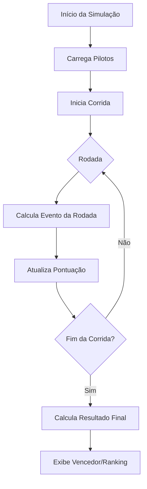

<div align="center">

# 🏁 Mario Kart Simulator com JavaScript

**Simulador de corrida no terminal com personagens do universo Mario Kart usando Node.js e JavaScript**

[](https://nodejs.org/)
[](https://developer.mozilla.org/pt-BR/docs/Web/JavaScript)
[](LICENSE)
[](#)

[Recursos](#-recursos) • [Tecnologias](#-tecnologias) • [Instalação](#-instalação) • [Como Jogar](#-como-jogar) • [Arquitetura](#-arquitetura)

</div>

---

## 📖 Descrição

Este projeto é um **simulador de corrida do Mario Kart no terminal com Node.js e JavaScript**, desenvolvido como exercício prático do curso de Node.js da DIO.

A aplicação executa corridas com personagens, voltas e regras simples de pontuação, focando em fundamentos de programação como:

- ✅ **Estruturação com módulos JavaScript**
- ✅ **Lógica de jogo orientada a regras**
- ✅ **Programação assíncrona**
- ✅ **Manipulação de dados com objetos e arrays**
- ✅ **Organização e legibilidade de código**

Toda a simulação acontece no terminal, permitindo acompanhar cada etapa da corrida e o resultado final.

---

## 🚀 Recursos

| Recurso | Descrição |
|---------|-----------|
| 🏎 **Simulação de Corrida** | Executa corrida completa no terminal com eventos por rodada |
| 🎮 **Personagens do Mario Kart** | Corrida entre pilotos com atributos diferentes |
| 🧠 **Regras de Jogo** | Aplica lógica de desempenho e pontuação durante a corrida |
| 🎲 **Eventos Aleatórios** | Introduz variações de resultado a cada execução |
| 📊 **Resultado Final** | Exibe classificação/vencedor ao fim da simulação |

---

## 🛠 Tecnologias

### Backend / Runtime
- **[Node.js](https://nodejs.org/)** - Ambiente de execução JavaScript
- **[JavaScript](https://developer.mozilla.org/pt-BR/docs/Web/JavaScript)** - Linguagem principal do projeto

### Ferramentas de Desenvolvimento
- **[Git](https://git-scm.com/)** - Controle de versão
- **[GitHub](https://github.com/)** - Hospedagem e colaboração
- **[VS Code](https://code.visualstudio.com/)** - Editor recomendado

---

## 📂 Estrutura do Projeto

```bash
.
├── src/                      # Código-fonte principal
│   ├── entities/             # Definições de personagens/estruturas do jogo
│   ├── utils/                # Funções utilitárias
│   └── index.js              # Ponto de entrada da simulação
├── package.json              # Dependências e scripts npm
└── README.md                 # Documentação do projeto
```

> A estrutura acima pode variar levemente conforme a evolução do projeto.

### Como Tudo se Conecta

**Fluxo da Simulação:**

```text
Execução do projeto
    ↓
Carregamento dos personagens
    ↓
Início da corrida (rodadas/voltas)
    ↓
Aplicação das regras de jogo
    ↓
Atualização de pontuação/desempenho
    ↓
Resultado final no terminal
```

1. O arquivo principal inicia a simulação.
2. Os personagens são carregados com seus atributos.
3. A corrida é processada por etapas.
4. A pontuação é calculada conforme os eventos.
5. O vencedor (ou ranking) é exibido ao final.

---

## ⚙️ Instalação

### Pré-requisitos
- **Node.js** (v18 ou superior)
- **npm**

### Passos

1. **Clone o repositório**
```bash
git clone https://github.com/MayconDMS/Mario-Kart-Simulator-with-javascript.git
cd Mario-Kart-Simulator-with-javascript
```

2. **Instale as dependências**
```bash
npm install
```

---

## ▶ Como Jogar

Execute o simulador com:

```bash
npm start
```

> Caso o projeto utilize outro script de execução (por exemplo `node src/index.js`), ajuste conforme o `package.json`.

A saída será exibida diretamente no terminal com o andamento da corrida e o resultado final.

---

## 🧪 Testes

Este projeto é focado em simulação prática e validação por execução no terminal.

Sugestões de validação manual:

- Executar múltiplas corridas para observar variações
- Verificar se as regras de pontuação estão consistentes
- Conferir comportamento em cenários de empate

---

## 🏗 Arquitetura



---

## 📚 Objetivos de Aprendizado

Este projeto reforça os seguintes conceitos:

### 1. **Lógica de Programação com JavaScript**
   - Condicionais e estruturas de repetição
   - Organização de regras de negócio
   - Resolução de problemas com algoritmos simples

### 2. **Modularização**
   - Separação por arquivos e responsabilidades
   - Reaproveitamento de funções
   - Código mais limpo e escalável

### 3. **Programação Assíncrona**
   - Fluxo de execução controlado
   - Operações assíncronas no Node.js
   - Melhor legibilidade de etapas da simulação

### 4. **Modelagem de Dados**
   - Uso de objetos para representar pilotos
   - Manipulação de arrays para ranking
   - Atualização de estados durante a corrida

### 5. **Boas Práticas de Projeto**
   - Nomenclatura clara
   - Separação de responsabilidades
   - Legibilidade e manutenção

---

## 🔮 Melhorias Futuras

- 🧩 Adicionar novos personagens e habilidades especiais
- 🌧 Inserir tipos de pista e condições climáticas
- 🧠 Melhorar IA/comportamento dos pilotos
- 📊 Exibir estatísticas detalhadas por corrida
- 🎯 Criar modo campeonato com várias etapas
- 🧪 Adicionar testes automatizados
- 🖥 Criar interface web para visualização da corrida

---

## 👨‍💻 Autor

**Maycon DMS**

- 🔗 [GitHub](https://github.com/MayconDMS)
- 💼 [LinkedIn](https://linkedin.com/in/maycon-dms)

---

## 📄 Licença

Este projeto está licenciado sob a **Licença ISC**.

---

<div align="center">

**Feito com ❤️ durante o curso de Node.js da DIO**

</div>
